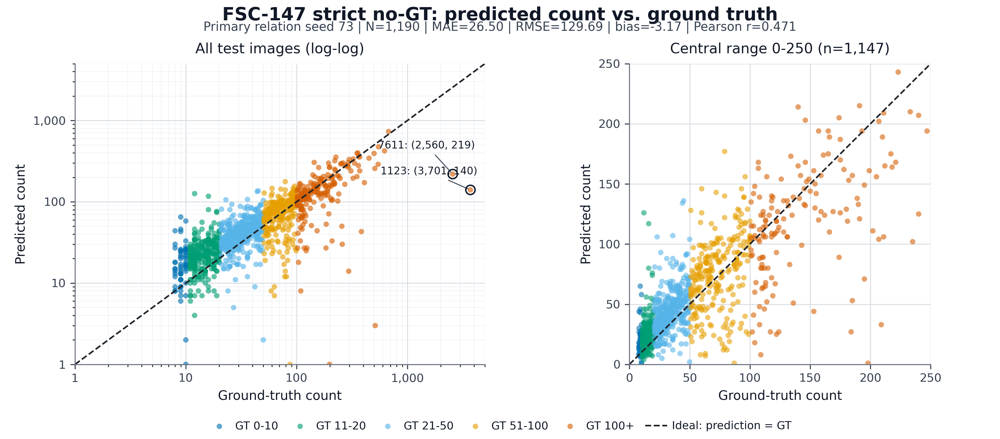

# FSC-147 Strict No-GT、CP-Free 全量重跑报告

**开始日期**：2026-07-10

**完成日期**：2026-07-11

**状态**：已完成 full test 1,190；结果、逐图预测与 bootstrap 已冻结

## 1. 目的

重新审计 FSC-147 `12.67 / 113.71` 的完整实现路径，删除所有 validation/test GT 参与预测的分支，并将 COCO relation pretraining 替换为 official-train-only FSC dot-supervised scratch relation heads。所有阈值和路由只在 official validation 上选择，配置冻结后才运行 full test 1,190。

## 2. 原 12.67 路径审计

| 模块 | 原配置 | 审计结论 |
|---|---|---|
| Candidate gate | cache `valid` 与 category confidence 取交 | `valid` 由候选是否覆盖 GT dot 决定；test GT 直接改变预测，属于信息泄露 |
| MR routing | 通过 `mr51/mr100` cache membership 选择前端 | cache 集合由 GT count 51-100/100+ 建立，属于隐式 GT 路由 |
| Category heads | `category_cosine_fast/pts32.pt` | 旧训练目录覆盖 train/val/test，训练 split 存在 official-test overlap |
| Text vocabulary | FSC-147 全 147 类原型 | FSC split 类别互斥；其中 val/test 独占的 58 个类名在旧 category 训练中作为负类出现，属于 transductive label-space access |
| Relation heads | `fsc147_relation_best/pts32_best.pt` | 含 `coco_relation_1152.pt` 初始化，且旧 FSC 训练 split 存在 overlap |
| T4 | fast raw candidate count为 0 时使用 4x4 | 触发值本身由图像候选产生，不读取 GT；保留为预声明 failure fallback |
| Test metric | full 1,190，MAE 12.6681 | 只能作为 GT-assisted/cache-compatible 历史结果，不能代表 strict no-GT 性能 |

原预测链的核心泄露代码包括：

- `script/eval_fsc147_full.py:182`：读取 test cache 的 GT-derived `valid`。
- `script/ablation_fsc147_multires_components.py:155-157`：所有 12.67 组件分支共用该门控。
- `script/eval_fsc147_omnicount_leaveoneout.py:197-203`：通过 GT-selected cache 是否存在决定 fast/MR51/MR100。

## 3. 新 strict no-GT 配置

### 3.1 允许与禁止字段

Validation/test inference cache 只允许：

`schema, img_id, file_name, z, bbox, height, width, source_cache`

硬性禁止：

`valid, purity, coverage, iou, matched_class, matched_instance_id, gt_count, class_name, is_part, is_countable, points`

加载器发现任一禁止字段会直接终止。Validation 不再调用合并的 annotation JSON，而只在全部 val 预测生成后加载物理隔离的 `fsc147_val_count_targets.json`；完整 annotation 仅在全部 1,190 张 test 预测生成后读入并用于计算指标。

### 3.2 学习组件

| 组件 | 数据 | 配置 |
|---|---|---|
| text prototypes | official train 类名 only | OpenCLIP ViT-B-32/LAION；89 类；与 val/test 类名交集为 0 |
| pts16 category | official train only | `cp_strict/category_pts16_trainvocab.pt`；内部 model-val top-1 85.99% |
| pts32 category | official train only | `cp_strict/category_pts32_trainvocab.pt`；内部 model-val top-1 85.02% |
| pts16 relation | official train dots only | `relation_pts16_trainvocab_scratch_seed{17,42,73}.pt`；禁止 `pretrained_from`；7,380 个 shared-dot 正样本对 |
| pts32 relation | official train dots only | `relation_pts32_trainvocab_scratch_seed{17,42,73}.pt`；禁止 `pretrained_from`；37,802 个 shared-dot 正样本对 |
| pts16 candidate filter | official train dots only | 2-layer MLP；内部 model-val P=92.89%，R=93.38% |
| pts32 candidate filter | official train dots only | 2-layer MLP；内部 model-val P=91.77%，R=92.01% |

Candidate filter 只在 train 阶段把“候选覆盖至少一个 train dot”作为监督；validation/test 只使用预测概率。这属于 FSC point supervision，不是 density-map supervision，但不能表述为完全无 point/count information。

Category head 使用 official-train 的 image-level 类别标签；relation head 的 instance 分支使用“两个候选被分配到同一个 train dot”作为 same-instance proxy。FSC dots 不提供真实 part-whole 标签，strict 推理中的 `A_part` 固定为零，因此本配置不能声称学习了 part-whole relation。

原型由 `build_fsc147_train_vocabulary.py` 直接读取 official-train cache 中的类 ID/类名后编码；脚本不读取 `ImageClasses_FSC147.txt`、validation/test image list 对应的类别，也不加载旧 147 类原型。训练器显式完成 global ID 到 89 类 local ID 的映射，并把原型及 metadata 哈希写入 checkpoint。

Relation label 审计发现仓库当前若干 FSC 预处理源码曾把 `matched_instance_id` 写成候选序号，与现存训练 cache 的真实语义不一致。现已统一修正为：未覆盖 dot 的候选记为 `-1`，有效候选记为其覆盖的第一个 train dot ID。strict relation 训练启动前全量验证 `valid <=> id>=0`、`id < gt_count` 和 shared-dot 正样本数，审计统计写入 checkpoint；缺少该 manifest 的权重会被 evaluator 拒绝。

#### 资产哈希与 relation 训练结果

| 资产 | SHA-256 |
|---|---|
| category pts16 | `9ffa9864ba1c7d0750ecbdcb9e8a932b92d1c3ad7cfe2f147338248e7419fc94` |
| category pts32 | `5726d7ffd2e0eafd772a65b3963ba975afc21af81910483569812769df330998` |
| candidate filter pts16 | `766ba5dc5e5a37840556bfee5d32067eaf86436b02aa6eaddf90469281f6754c` |
| candidate filter pts32 | `55d530c3c942ecb873fbbb7433b74ab24c23a2f544f9ff206f79832daec2de11` |
| train-89 prototypes | `125a529726a568a19a0b4886d1c8a6661adbd35abb26e94de09bef339a125106` |

| Frontend | Seed | Best epoch | 内部 val loss | instance P/R | Checkpoint SHA-256 |
|---|---:|---:|---:|---:|---|
| pts16 | 17 | 34 | 0.0787 | 38.5% / 80.4% | `63fbade6b664ae8f986155e1e9e4a610fead9d6c3bc0beb51cb9ee057dcb2bad` |
| pts16 | 42 | 38 | 0.0831 | 42.6% / 77.5% | `55e047377ae92ef9e0e57125764a2cd961fae9b0f35271a14e83ec25d8e607b5` |
| pts16 | 73 | 21 | 0.1271 | 31.0% / 60.8% | `e3a70cd40a41fc62b6a32c9ce2045daa7ea47ee3d54de0c102f9f93d35495d2f` |
| pts32 | 17 | 36 | 0.1043 | 59.2% / 91.6% | `16dfe4bf1e1d0cd9e47bdedf42b70f59eefc9710228b1e1f8398f899f6165b90` |
| pts32 | 42 | 36 | 0.1042 | 60.2% / 90.4% | `4c88c73f2dfefe727f698072660f248bfc2028d7e37c12df674615fc824b3c7f` |
| pts32 | 73 | 27 | **0.0996** | 38.7% / 97.5% | `ecf09d2967fc10cb901a6fd2858e551a78ca8e84367d8fadafff75af3d142e48` |

### 3.3 前端与路由

- fast：所有图统一生成 pts16 full-image safe cache。
- tiled：所有图统一生成 pts32、2x2、overlap=0.25 safe cache；不再只给 GT>50 图生成。
- 路由输入只使用 fast 的预测 count；阈值在 official val 上选择后冻结。
- raw fast candidate count为 0 的触发条件本身不读取 `valid` 或 GT count。4x4 配方最终只用 official-train fast-zero 样本选择，因此满足计算路径 no-GT；但候选 recipe 集合曾受历史 test `7611.jpg` 启发，不能把本次结果描述成研究过程中的 untouched/blind test。
- 不通过 cache 文件是否存在判断密度；val/test fast 与 tiled cache 必须分别精确覆盖完整 split。

Validation safe cache 全量审计：fast 共 51,731 candidates（40.23/image），tiled 共 183,070（142.36/image；median 116、P90 269、max 1,175）；两者均精确覆盖 1,286 张、zero=0、无禁止字段或非有限 tensor。

Official-train 缺失 fast cache 的 3 张图中，`2737.jpg` 与 `2979.jpg` 是本地 0-byte 损坏文件，不能作为模型 failure；可解码的真实 fast-zero case 只有 `7454.jpg`（GT 197）。T4 recipe 仅在该图上于 2x2/3x3/4x4 间选择，固定使用 pts32 candidate filter 的 `p>=0.5` 预测候选数，按 train count MAE、RMSE、较低 tile 数依次排序；预测完成后才加载隔离的 1-image train target shard。该选择不接触 test GT，但单样本 calibration 的局限必须披露。

| train recipe | raw candidates | filter count | GT | 绝对误差 |
|---|---:|---:|---:|---:|
| 2x2 | 70 | 22 | 197 | 175 |
| 3x3 | 294 | 90 | 197 | 107 |
| **4x4（冻结选择）** | **439** | **117** | **197** | **80** |

选择记录：`result/configs/fsc147_train_rescue_selection.json`；`test_images_loaded=0`，pts32 candidate-filter SHA-256 前缀为 `55d530c3c942ecb8`。

## 4. Validation-only 选择

预注册网格：

- candidate filter threshold：`0, 0.05, 0.1, 0.2, 0.3, 0.4, 0.5, 0.6`
- category confidence threshold：`0, 0.1, 0.2, 0.3, 0.4, 0.5`
- `tau_inst`：`0.99, 0.999`
- predicted fast count route threshold：`10, 20, 30, 40, 50, 75, 100`，并比较 always-fast/always-tiled

pts16/pts32 frontend 参数先分别按三个 relation seeds 的 validation mean MAE 选择，再选择一个共同路由策略。test 不参与任何选择。

Validation count shard 由 `export_fsc147_count_targets.py` 逐个打开 official-val cache 导出，manifest 记录 `nonselected_images_loaded=0`；validation 进程不会解析包含 test GT 的 44 MB 合并 annotation 文件。

冻结输出：`result/logs/fsc147_strict_nogt_val_selection.json`，SHA-256 `8c4f0c61cdf74221470cd41fcc58837be7f39ba37b5f08b50d303b9b3ab5ee16`；文件内 `frozen=true`、`test_read=false`，并绑定 12 个模型资产与 12 个预测/候选生成代码文件的 SHA-256。

| 项目 | validation-only 选择 |
|---|---|
| fast config | filter=0.05，category=0，`tau_inst=0.99` |
| tiled config | filter=0.3，category=0.4，`tau_inst=0.99` |
| route | **always tiled** |
| primary seed | **73**（validation MAE 最低；test 不参与） |
| raw candidates | fast 40.23/image；tiled 142.36/image；两者 zero images 均为 0 |

| Route | Val MAE mean | Val RMSE mean | 每 seed routed tiled |
|---|---:|---:|---:|
| always fast | 36.71 | 121.06 | 0 |
| predicted count >=10 | 31.33 | 105.84 | 1,124-1,127 |
| **always tiled** | **30.31** | **102.37** | **1,286** |

| Relation seed | Val MAE | Val RMSE | bias |
|---:|---:|---:|---:|
| 17 | 30.61 | 102.37 | -13.19 |
| 42 | 30.31 | **102.19** | -13.72 |
| **73（primary）** | **30.00** | 102.53 | -15.24 |

## 5. Full Test 1,190

Validation 配置提交后运行 image-only `plan-test`，输出 `result/configs/fsc147_strict_nogt_test_tile_plan.json`，SHA-256 `10b4a4990da95e9c591dceffb4aa0c5c2a5c09bc834f1e17dfb90df0106a6d8d`。记录中 `test_annotations_read=false`、`prediction_gt_fields=[]`：

- always-tiled 路由：1,189 张；三个 relation seeds 的集合完全一致。
- raw-fast-zero：`7611.jpg`；按 train-only 选择的 4x4 recipe 单独 rescue。

测试前逐文件安全扫描结果：

| Cache | 图像数 | Candidates | Mean / Median / P90 / Max | Zero | 审计 |
|---|---:|---:|---:|---:|---|
| pts16 fast | 1,190 | 64,438 | 54.15 / 45 / 103 / 227 | 1 | schema、ID、finite tensor 全通过 |
| pts32 2x2 tiled | 1,189 | 206,771 | 173.90 / 148 / 301.2 / 908 | 0 | source 全为冻结的 `tiled-nogt-2x2-overlap0.25-bbox` |
| pts32 4x4 rescue | 1 | 1,997 | 1,997 / 1,997 / 1,997 / 1,997 | 0 | source 为 train-selected 4x4 recipe |

测试只执行一次。所有 1,190 张预测先保存在内存中，之后才首次读取 test annotation 并计算指标。完整输出：`result/logs/fsc147_strict_nogt_cp_free_full1190.json`，SHA-256 `a455706c602a3b386488983b94db394e7ba3dd65ca7536aac535aff2121a184c`。

### 5.1 Full-test 主结果

| Relation seed | MAE | RMSE | Bias | MAE bootstrap 95% CI | RMSE bootstrap 95% CI |
|---:|---:|---:|---:|---:|---:|
| 17 | 29.3067 | 129.6714 | +1.0529 | [23.5737, 37.6704] | [37.5825, 207.3796] |
| 42 | 28.1882 | **129.4034** | -0.1815 | [22.5041, 36.5172] | [36.9775, 209.6080] |
| **73（validation 预选 primary）** | **26.4992** | 129.6856 | -3.1748 | [20.7099, 35.2550] | [35.9716, 210.5349] |
| **3-seed mean ± sample std** | **27.9980 ± 1.4134** | **129.5868 ± 0.1590** | - | - | - |

主结果必须使用 validation 预先选择的 seed 73，即 **MAE=26.50 / RMSE=129.69**。三个 seed 的均值只表示 relation 初始化稳定性，不能替代预注册 primary，也不覆盖 category/filter 的训练随机性。

### 5.2 Prediction-GT 散点图

左图使用 log-log 坐标显示全部 1,190 张 test 图，右图在线性坐标下放大 count 0-250 的 1,147 张主体样本；虚线为理想预测 `prediction=GT`。Primary seed 73 的 Pearson `r=0.4713`。低/中密度样本大量位于虚线上方，对应系统性过计数；`1123.jpg` 与 `7611.jpg` 则远低于虚线，是 RMSE 的主要极端误差来源。

矢量版本：[`fsc147_strict_nogt_pred_vs_gt_seed73.pdf`](figures/fsc147_strict_nogt_pred_vs_gt_seed73.pdf)。绘图入口：`script/plot_fsc147_strict_pred_vs_gt.py`。

### 5.3 Primary seed 分桶

| GT count bin | Images | MAE | RMSE | Bias | Mean pred / GT |
|---|---:|---:|---:|---:|---:|
| 0-10 | 60 | 11.08 | 15.81 | +10.22 | 19.37 / 9.15 |
| 11-20 | 268 | 10.73 | 16.35 | +9.65 | 24.46 / 14.81 |
| 21-50 | 413 | 14.53 | 19.52 | +10.76 | 44.43 / 33.67 |
| 51-100 | 254 | 22.99 | 29.63 | +2.29 | 74.85 / 72.57 |
| 100+ | 195 | **82.84** | **316.61** | **-61.55** | 153.74 / 215.29 |

误差呈现明确的密度失配：低/中密度系统性过计数，100+ 系统性漏计。Top 1% 图像贡献 27.29% 总绝对误差，Top 5% 贡献 42.64%。

### 5.4 极端失败分析

| Image | GT | Pred | Abs. error | 诊断 |
|---|---:|---:|---:|---|
| `1123.jpg` | 3,701 | 140 | 3,561 | 2x2 前端只有 354 个 raw candidates，proposal recall 是首要上限 |
| `7611.jpg` | 2,560 | 219 | 2,341 | 4x4 有 1,997 个 raw candidates，但冻结 gate 只保留 246 个 |

`7611` 的 1,997 个候选中，filter>=0.3 有 748 个、category confidence>=0.4 有 584 个、两者联合仅 246 个；seed 73 去重后计数 219。去掉 `7611` 后为 MAE=24.55 / RMSE=110.56；去掉 `1123` 与 `7611` 后 MAE=21.58 / RMSE=39.49。说明 remaining error 同时来自 proposal recall 与 train-vocabulary/category-filter gate，不能只靠 relation head 修复。

### 5.5 与历史 12.67 的关系

| 结果 | MAE | RMSE | 可否作为 no-GT 主结果 |
|---|---:|---:|---|
| 历史 MR+T4 | 12.6681 | 113.7111 | **否**：GT-derived `valid`、GT 路由和训练 overlap |
| 新 strict no-GT、CP-free primary | **26.4992** | **129.6856** | **是，计算路径通过审计** |

两者相差 +13.8311 MAE，但这不是“去掉 CP”的单组件增量：本轮同时修复 candidate gate、路由、训练 split、文本词表和 relation 初始化。此前严格配对 CP/scratch 实验的差异接近零，因此不能把这 13.83 归因于移除 COCO；主要差距更可能来自旧 GT candidate oracle、旧 split overlap 和新 train-only 词表/过滤器，但要量化各项必须在当前 strict cache 下另做 train/validation-frozen leave-one-out。

### 5.6 保留 GT oracle 的词表归因实验

为判断历史低 MAE 是否依赖提前知道 FSC test 类名，另做了一个明确保留旧 GT-derived `valid`、GT-selected MR 路由、旧 relation 与 T4 的诊断实验：

| Category / vocabulary | MAE | RMSE | 解释 |
|---|---:|---:|---|
| 旧 head + full-147 | 12.6681 | 113.7111 | 历史锚点 |
| 旧 head + 删除 test 29 行 | 57.5790 | 145.6918 | 旧 head 与完整词表强耦合，直接裁行导致置信度坍缩 |
| train-only head + full-147 | 15.5479 | 114.7505 | same-head 词表参考 |
| train-only head + 删除 test 29 行 | 14.1218 | 111.7693 | 相对同 head full-147 改善 1.4261 MAE |
| **train-only head + direct train-89** | **13.1109** | **109.6685** | val/test 类名均为 0；相对历史 12.67 配对差 +0.4429，95% CI [-0.4950, 1.0412] |

该结果说明 test 类名不是 GT-assisted 低 MAE 的必要条件；真正支撑 12.67 量级的是 GT candidate oracle 等历史协议。`13.11` 仍不是 no-GT 结果，也不改变本报告 `26.50` 的主结果地位。完整记录见 `docs/fsc147_gt_assisted_vocabulary_ablation_report_20260711.md`。

## 6. 结论与投稿口径

1. 原 `12.67 / 113.71` 必须从论文主结果撤下，只能保留为 GT-assisted historical diagnostic。
2. 当前可复现主结果是 seed 73 的 `26.50 / 129.69`，训练监督应写成 **FSC point/dot-supervised、density-map-free**，不能写 `count-supervision-free`。
3. 推理不接收 exemplar、per-image class name 或 test GT；但内部使用固定的 89 类 official-train 文本原型。FSC test 类别在该词表之外，因此本实验只验证 count，不能支撑“正确输出 test 类别名”。
4. strict relation 推理只用 learned instance branch，`A_part=0`；不能据此声称学习了 part-whole relation。
5. SAM2、DINOv2 与 OpenCLIP 仍使用外部 foundation pretraining；“CP-free”只表示 relation head 没有 COCO 初始化。
6. 代码级 no-GT 已消除，但 FSC test 曾被项目反复查看，尤其 rescue 受 `7611` 启发；投稿时应披露 test familiarity，并优先在未触碰的新数据集复核主结论。

## 7. 复现入口

- `script/train_candidate_filter.py`：official-train-only candidate filter。
- `script/build_fsc147_train_vocabulary.py`：从 official train 类名直接构建 89 类原型。
- `script/train_category_v2.py --prototype_label_map`：global→train-local 标签映射。
- `script/train_relation_1152.py --require_train_only_vocabulary`：禁止 COCO 初始化并绑定上游资产哈希。
- `script/export_fsc147_inference_cache.py`：物理删除 GT 字段。
- `script/export_fsc147_count_targets.py`：导出物理隔离的 train/val count shard。
- `script/preprocess_fsc147_tiled_nogt.py`：不加载 annotation 的 tiled candidate 生成。
- `script/select_fsc147_train_rescue.py`：仅用 train fast-zero failure cases 冻结 rescue recipe。
- `script/eval_fsc147_strict_nogt.py`：validation freeze 与 test 两阶段入口。
- `script/plot_fsc147_strict_pred_vs_gt.py`：从 frozen full-test JSON 复算指标并生成 PNG/PDF 散点图。
- `script/eval_fsc147_leaky_filter_vocab_ablation.py`：保留旧 GT oracle 的词表泄露归因实验。
- `docs/figures/fsc147_strict_nogt_pred_vs_gt_seed73.{png,pdf}`：primary seed 73 的全量图与矢量版本。
- `result/logs/fsc147_leaky_filter_vocab_ablation_full1190.json.gz`：七变体 full-test 逐图结果。
- `docs/fsc147_gt_assisted_vocabulary_ablation_report_20260711.md`：词表归因中文报告。
- `result/configs/fsc147_train_fast_zero_images.json`：train-only rescue 选择样本；test fast-zero 名单由冻结后的 `plan-test` 动态输出。
